# 🧠⚡ TypeSafe AI, the Easy-Peasy Guide

### How to build great AI apps that are **cheap**, **fast**, and **reliable**, explained step by step with no jargon

> 🌐 **Prettier version with an interactive cost calculator:** https://mrinalsinghraja.github.io/typesafe-easy-guide/

---

## 📖 Contents

1. [The 30-second idea](#1--the-30-second-idea)
2. [The 3 tools you'll use](#2--the-3-tools-youll-use)
3. [Step-by-step: your first app](#3--step-by-step-your-first-app)
4. [The 7 golden rules for low cost + high speed](#4--the-7-golden-rules-for-low-cost--high-speed)
5. [The "optimal" app blueprint](#5--the-optimal-app-blueprint)
6. [Real app ideas](#6--real-app-ideas)
7. [Mistakes to avoid](#7--mistakes-to-avoid)
8. [Cheat sheet](#8--cheat-sheet)

---

## 1. 💡 The 30-second idea

Most people use big chat AIs (like ChatGPT or Claude) for **everything**. That works, but it's like **hiring a professor to tick checkboxes**. It's slow, it costs more, and the professor answers in paragraphs that your app then has to read and untangle.

**TypeSafe's Jev model** is a different kind of AI. It doesn't write essays. You ask it short questions, and it answers with a **number or a pick from a list**, ready for your code to use.

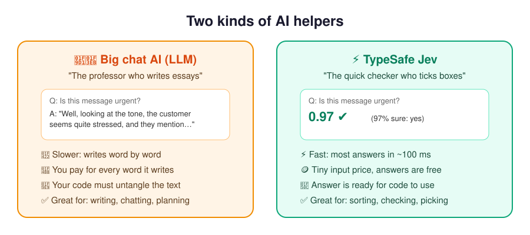

**In one sentence:**
> Let **plain code** do the steps, let **Jev** make the quick "common sense" calls, and only call a **big AI** when you truly need writing or deep thinking.

This is how Jev fits in (diagram from the official TypeSafe docs):

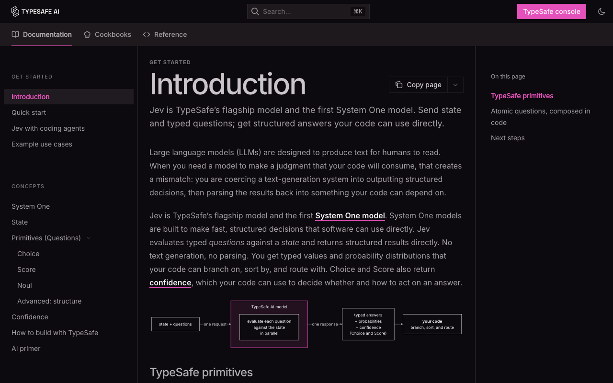

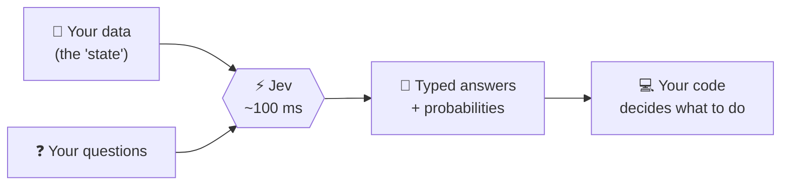

---

## 2. 🧰 The 3 tools you'll use

Every Jev question is one of three types. That's all you need to learn.

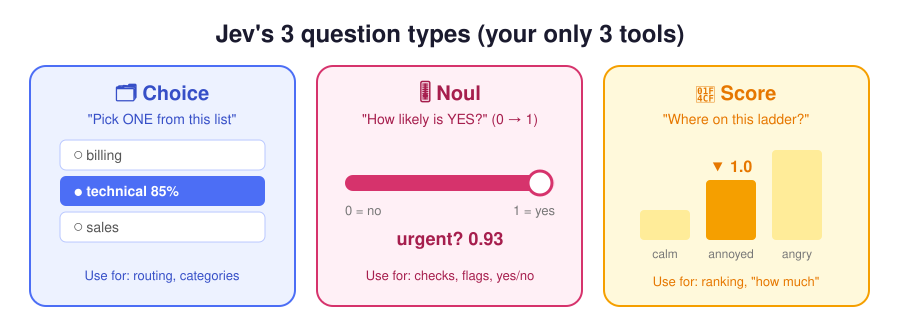

| Tool | What you ask | What you get back | Real-life example |
|---|---|---|---|
| 🗂️ **Choice** | "Pick ONE from this list" | the pick + % for each option + confidence | Which team handles this ticket? |
| 🎚️ **Noul** | "Is this true?" | a probability from 0 (no) to 1 (yes) | Does the customer want a refund? |
| 📏 **Score** | "Where on this ladder?" | a position like 1.4 on your levels + confidence | How angry is the customer? |

> 💬 **Tip:** A Noul of **0.5** means "can't tell", not "medium". If you want "how much", use **Score**.

---

## 3. 🪜 Step-by-step: your first app

We'll build a **support-ticket sorter**: it reads a customer message and decides which team gets it, how urgent it is, and whether to flag a refund.

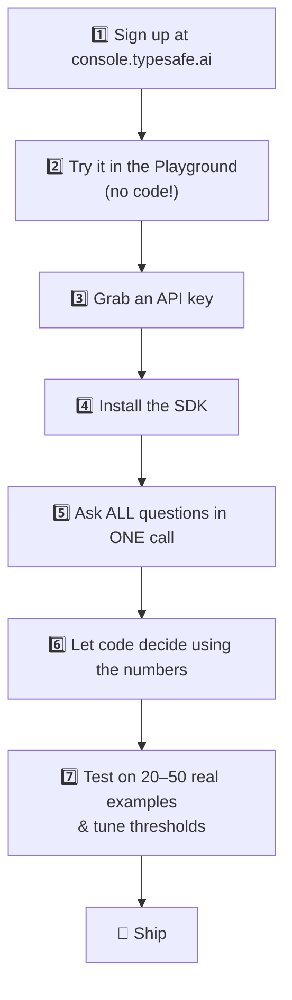

### Step 1: Sign up

Go to **https://console.typesafe.ai/** and log in with Google or email.

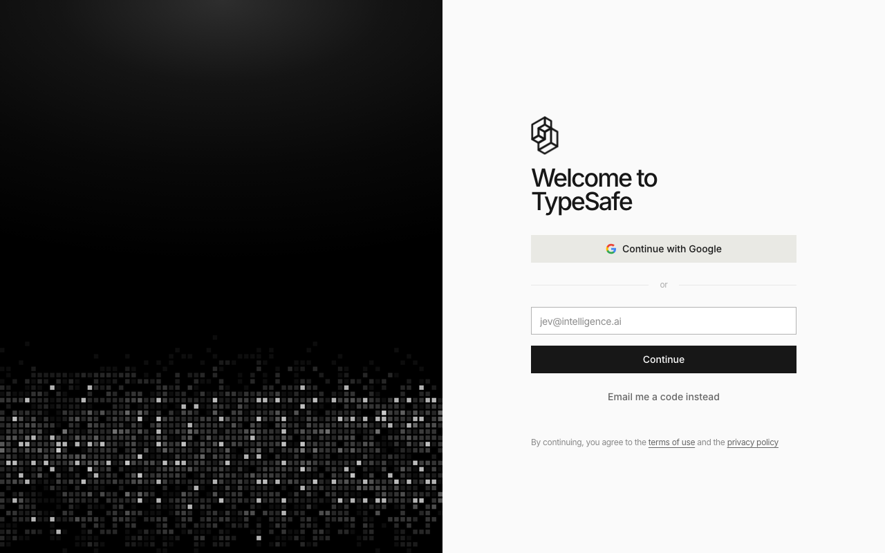

### Step 2: Play first, with no code

Open the **Playground**: https://console.typesafe.ai/playground

1. Paste any text as the **state**, for example:
   `Hi, I've been trying to connect my Stripe account for 3 days and the integration keeps failing. I'm losing sales. Please help ASAP.`
2. Add a question: `"Does this message express urgency?"` (type: **noul**)
3. Add a Choice and a Score too, then watch all the answers come back at once.

> 🎯 Keep editing the wording of your questions in the Playground until the answers look right. This is the cheapest place to experiment.

### Step 3: Get an API key

Dashboard → **Keys**: https://console.typesafe.ai/keys. Then in your terminal:

```bash
export TYPESAFE_API_KEY="paste-your-key-here"
```

> 🔒 **Never** put this key in a website or mobile app's frontend code. Keep it on your server.

### Step 4: Install

```bash
# Python (3.10+)
pip install typesafe-sdk

# or JavaScript / TypeScript (Node 20+)
npm install @typesafe-ai/sdk
```

Or just try it with `curl`: see [`examples/first_call.sh`](examples/first_call.sh).

### Step 5: Ask everything in ONE call

```python
from typesafe_sdk import Choice, Noul, Score, TypeSafeClient

with TypeSafeClient() as client:
    r = client.system_one(
        state={"ticket": "I was charged twice. Please fix this ASAP."},
        questions={
            "team": Choice(
                instructions="Which team should handle this ticket?",
                criteria={
                    "billing": "Payment or subscription issues",
                    "technical": "Bugs or integration problems",
                    "other": "None of the above",
                },
            ),
            "urgent": Noul(instructions="The message conveys urgency."),
            "frustration": Score(
                instructions="How frustrated does the customer appear?",
                criteria=["Calm", "Frustrated but civil", "Very angry"],
            ),
        },
        model="jev-latest",
    )
```

What comes back looks like this (real sample from the docs):

```json
"department":  { "choice": "technical", "confidence": 0.78,
                 "probabilities": { "technical": 0.85, "billing": 0.15, "sales": 0.0 } },
"frustration": { "score": 1.0, "confidence": 1.0 },
"is_urgent":   { "noul": 1.0 }
```

### Step 6: Let *code* make the decision

```python
team = r.choices["team"]
queue = team.choice if team.confidence >= 0.5 else "human-review"
priority = "P1" if r.nouls["urgent"].noul > 0.8 else "P2"
```

The AI gives you **evidence** (numbers), and your code sets the **rules**. You can change a rule later without paying for new AI calls.

📂 The full working example is in [`examples/support_triage.py`](examples/support_triage.py).

### Step 7: Test, tune, ship

- Run 20–50 **real** messages through it.
- Check where it's wrong, then reword the question or add clearer option descriptions.
- Pick thresholds (0.5, 0.8…) based on **your** results, not guesses.

---

## 4. 🏆 The 7 golden rules for low cost + high speed

### Rule 1: 📦 One envelope, many questions (the biggest saving)

Your document (the "state") is usually the expensive part. If you ask 13 questions in 13 calls, you pay for the document 13 times. **Put all questions in one call** and you pay once.

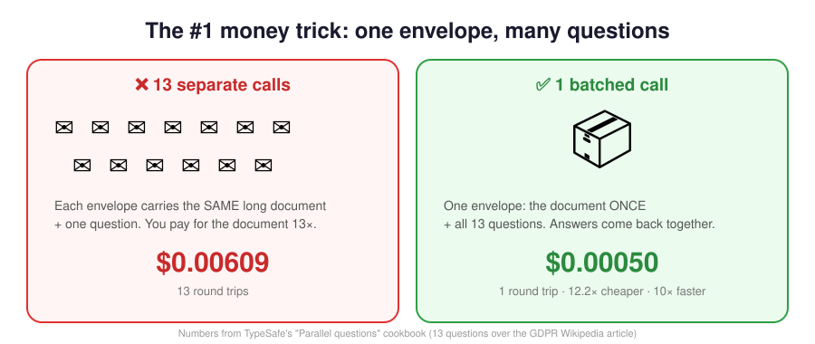

Proof from TypeSafe's own cookbook:

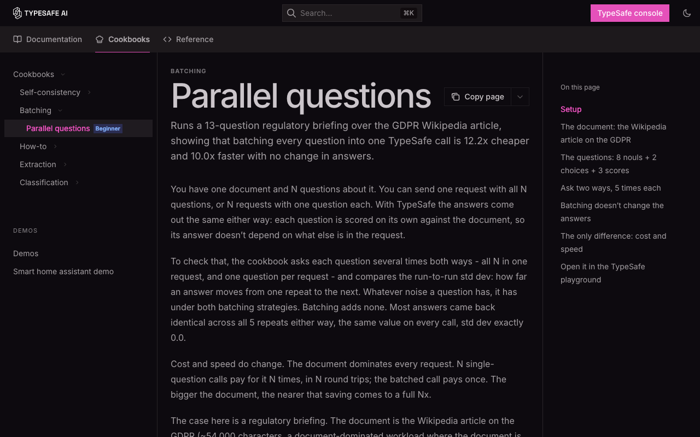

### Rule 2: 💻 If plain code can do it, don't use AI

Math, dates, exact lookups, "if price > 100", database queries: these cost **$0** in code. Use AI **only** where you need *understanding* ("is this polite?", "which of these matches?").

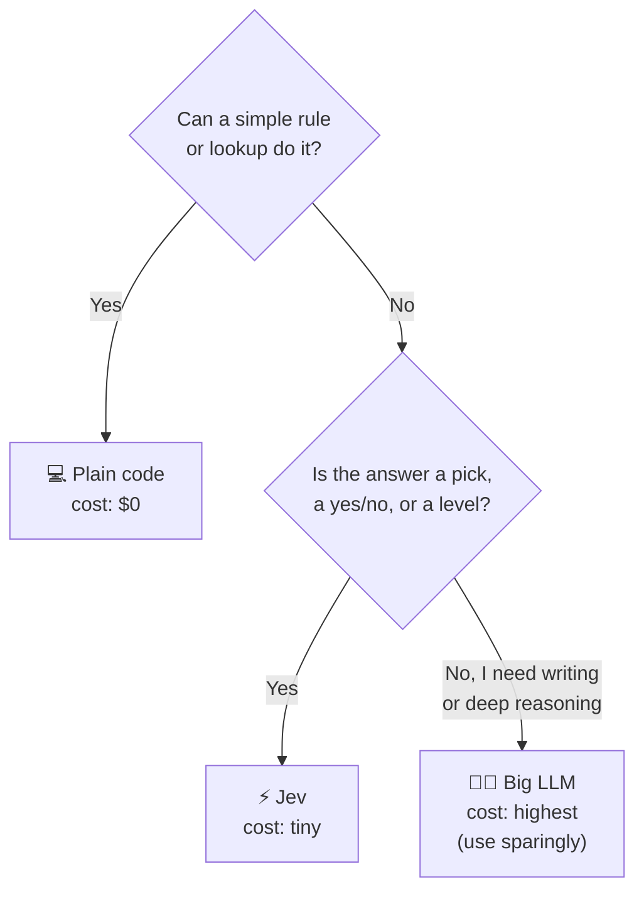

### Rule 3: 👉 Pick, don't write

Need to pull a date or price out of an email? Let code **find all candidates** (e.g. every date in the text), then ask Jev a **Choice**: "which of these is the due date?" Picking is cheaper and can't invent fake values. Just make sure the right answer is in the list.

### Rule 4: 🪜 Cheap first, expensive only if needed

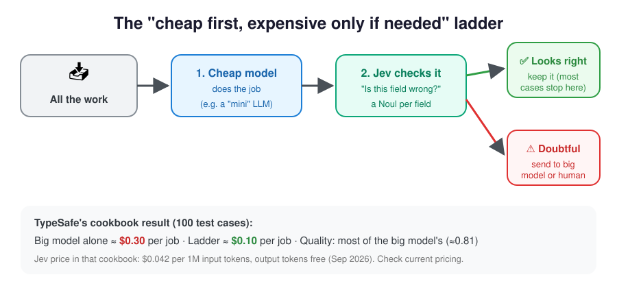

Let a cheap model do the work, have Jev **check** it, and only send the doubtful cases to the expensive model (or a human).

### Rule 5: ✂️ Send only what the question needs

Don't paste your whole database. Send the relevant bits as named fields:

```python
state = {"ticket": {...}, "customer": {"plan": "pro"}, "policy": "..."}
```

You can point to parts of it in a question, like `` `ticket.messages[0].text` ``.

### Rule 6: 💾 Score once, reuse forever

Save Jev's raw numbers in your database. Changing weights, filters, or rankings later then needs **no new AI calls**.

### Rule 7: 🚦 Use confidence as a traffic light

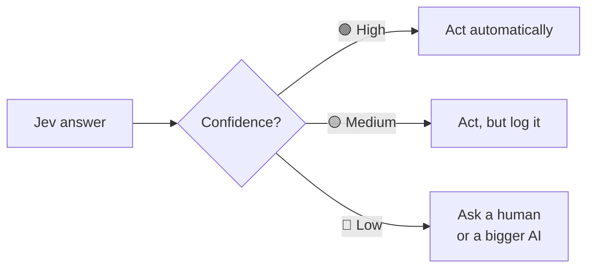

You pay for expensive help **only on the hard cases**.

---

## 5. 🏗️ The "optimal" app blueprint

This is the shape of a cheap, fast, reliable AI app:

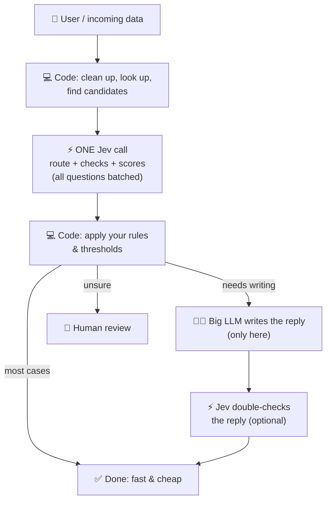

| Layer | Job | Cost |
|---|---|---|
| 💻 Code | steps, rules, math, lookups | free |
| ⚡ Jev | understanding: pick / yes-no / level | tiny, ~100 ms |
| 🧑‍🏫 Big LLM | writing & deep reasoning | highest, so call it rarely |
| 🙋 Human | truly unsure cases | slowest, so call them rarely |

---

## 6. 💡 Real app ideas

| App | What Jev decides | Tool |
|---|---|---|
| 📨 Smart inbox | which folder, is it urgent, is it spam | Choice + Noul |
| 🛍️ Review analyzer | sentiment level, mentions price / quality / delivery | Score + Noul per topic |
| 🔍 Better search | how relevant each result is to the query | Score per result (rerank) |
| 🤖 Voice / chat commands | which action ("lights", "music", "timer") + its settings | Choice (function calling) |
| 📑 Form / invoice reader | pick the right value from candidates code found | Choice |
| ✅ AI fact-checker | does this source support this sentence? | Noul |
| 🧑‍💼 Resume screener | fit per skill, then code weights them | Score per skill |

Browse the ready-made recipes: https://docs.typesafe.ai/ → **Cookbooks**.

---

## 7. 🚫 Mistakes to avoid

| ❌ Don't | ✅ Do |
|---|---|
| Ask one huge vague question ("Is this good?") | Split into small clear ones ("Is it polite?", "Is it on-topic?") |
| Make one call per question | Batch them all in one call |
| Treat Noul 0.5 as "medium" | 0.5 = "can't tell". Use Score for "how much" |
| Forget a "none of these" option | Add an `other` / `none` choice |
| Put the API key in frontend code | Call TypeSafe from your server |
| Copy thresholds from examples | Tune them on your own real data |
| Use a big LLM for sorting/checking | Use Jev; save the big LLM for writing |

---

## 8. 📝 Cheat sheet

```
┌──────────────────────────────────────────────────────────┐
│  CODE  does steps & rules        → $0                    │
│  JEV   makes quick judgments     → tiny $, ~100 ms       │
│  LLM   writes / reasons deeply   → $$$, use rarely       │
├──────────────────────────────────────────────────────────┤
│  1 call, many questions   → pay for your data once       │
│  Pick, don't generate     → cheaper + no made-up values  │
│  Cheap → check → escalate → big-model quality, less $    │
│  Save raw scores          → change rules for free        │
│  Low confidence           → human / bigger model         │
└──────────────────────────────────────────────────────────┘
```

### 🔗 Links

- Docs: https://docs.typesafe.ai
- Console, Playground & API keys: https://console.typesafe.ai
- Batching proof: https://docs.typesafe.ai/cookbooks/parallel_questions
- Cheap→check→escalate recipe: https://docs.typesafe.ai/cookbooks/sde_cascade

---

<sub>Unofficial community guide by [@mrinalsinghraja](https://github.com/mrinalsinghraja). Not affiliated with TypeSafe AI. Screenshots show docs.typesafe.ai and console.typesafe.ai as of Sept 2026. Prices and numbers come from TypeSafe's public cookbooks and may change, so check the official docs.</sub>
